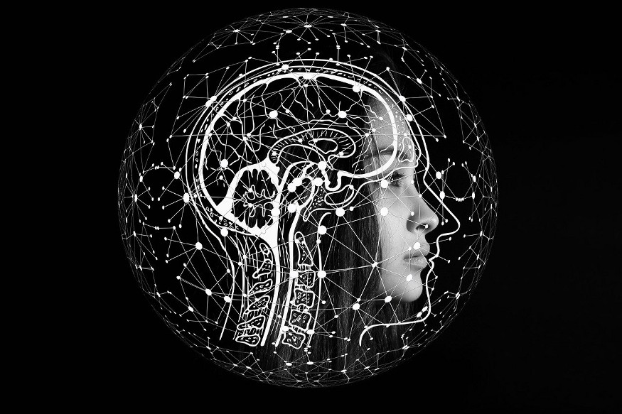

Artificial Intelligence is in more places than ever before. This is a pretty bold statement, but lots of governments are taking it seriously and planning to grow education, research, and development in AI. China’s plan alone calls for over 100 billion U.S. dollars in funding over the next 10 years.

AI has the potential to add US$957 billion, or 15 percent of India’s current gross value in 2035. The combination of the technology, data and talent that make intelligent systems possible has reached critical mass, driving extraordinary growth in AI investment.

## So, What’s next? What’s the future of AI?

One way to think about the future of Artificial Intelligence is to consider milestones AI hasn’t reached yet.
Current robots aren’t quite ready to take on human professionals, and Siri and Google Assistant still has a lot of trouble understanding exactly what I’m saying. For every AI system, we can try and list what abilities would take the current technology to the next level.

### Levels of Automation

Every industry is becoming more technologically advanced every day. As automation, artificial intelligence and robotics improve, it may be increasingly tempting to employ automatic means to accomplish industry goals. The degree to which a task is automated is referred to as levels of automation where level 1 may be a very basic task and the last level will be the full automation of the process.

### Self-driving Cars

In 2014, for example, the Society of Automotive Engineers attempted to do just that for self-driving cars. They defined five levels of automation. For each additional level, they expected that the AI controlling the car can do more without human help.

· At level 1, the cruise control automatically accelerates and decelerates to keep the car at a constant speed, but everything else is on the human driver.

· At level 3, the car is basically on its own. It’s driving, monitoring its surroundings, navigating, and so on… but a human driver will need to take over if something goes wrong, like really bad weather or a downed power line.

· At level 5, the human driver can just sit back, have a smoothie, and watch YouTube videos, and of course read my article, while the car takes them to work through rush-hour traffic.

And obviously, we don’t have cars with the technology to do all this yet. But these levels are a way to evaluate how far we’ve come, and how far our research still has to go.

---

## How AI might be able to change our lives?

To understand how AI might be able to change our lives, AI Professors Yolanda Gil and Bart Selman put together the Computing Research Association’s AI Road-map for the next 20 years.

They predict AI reducing healthcare costs, personalizing education, fast-tracking scientific discoveries, helping national defense, and more. Part of the reason they expect so much progress is that more people than ever (including you!) are learning how to build AI systems.

And all of these problems have lots of data to train new algorithms. It used to be hard to collect training data, going to libraries to copy facts, and transcribe books. But now, a lot of data is already digital. If you want to know what’s happening on the other side of the planet, you can download newspapers or grab feeds from the Facebook API.

 

## My Views

We started Artificial Intelligence to replicate the human mind, and that’s pretty much the future end goal of Artificial Intelligence, to make it as intelligent as a human brain and someday more intelligent than humans. Computers nowadays can-do endless calculations in a matter of seconds, can send information from one end of the earth to another with ease. But being ‘intelligent’ is not the ability to do any of that, it’s the ability to understand information and know how to use it based on pre-existing experience.

Much of the progress of Artificial Intelligence also has to do with understanding the way the human mind works, something which we aren’t even close to understanding. In fact, we don’t even know what it’s limits are. Till now computers could only compute large amounts of information and nothing else, but AI changes that.

Now we can teach the computer how to do things and it can do the same task in thousands of different ways and learn from the experiences.

So,once we come up with algorithms to completely mimic the human way of thinking , it will be able to perform the same tasks we do with much more efficiency and with way fewer resources than if a human were to do it. That’s the future of AI.